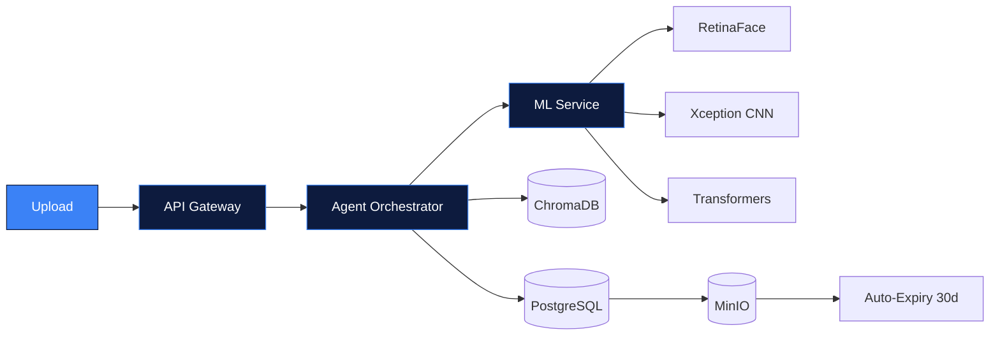
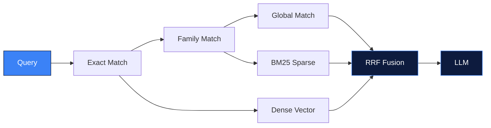
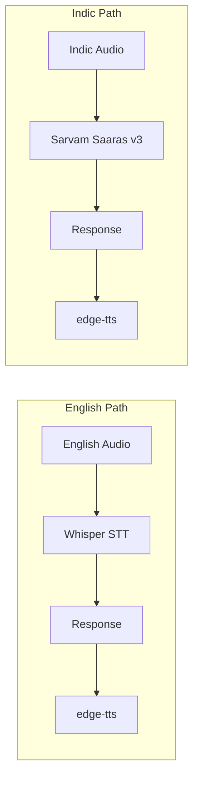
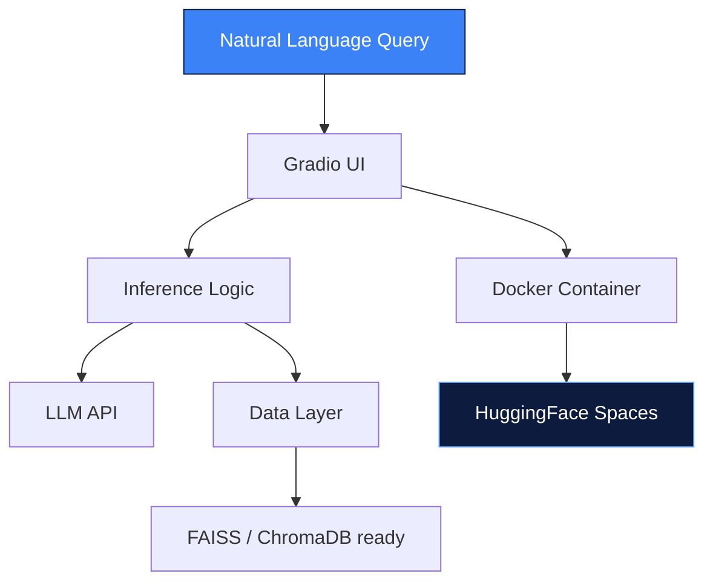
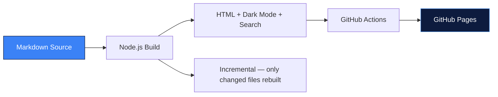

<div align="center">


<!-- ══════════════ COLD OPEN ══════════════ -->

[](https://git.io/typing-svg)

<br>

<table>
<tr>
<td align="center" width="140">

<br><b><sub>SCOUT-7</sub></b>
<br><sub><i>talent-recon unit</i></sub>
</td>
<td align="center" width="60"><h2>⇄</h2></td>
<td align="center" width="140">

<br><b><sub>SANTHOSH.exe</sub></b>
<br><sub><i>engineer runtime</i></sub>
</td>
</tr>
</table>

</div>

<br>

<div align="center">

```
◈ TRANSCRIPT LOG — CHANNEL #build-verify — SESSION OPEN ◈
```

</div>

<br>

> 🔵 **SCOUT-7:** New signal on the network. Runtime, identify yourself.

> 🔷 **SANTHOSH.exe:** Santhosh — 3rd year CSE, Karpagam Institute of Technology. I don't build demos, I build things that stay up after the deploy.

---

<br>

### `Q01` — *"What's your actual operating principle?"*

<div align="center">

[](https://git.io/typing-svg)

</div>

<details open>
<summary><b>🔷 SANTHOSH.exe — expand full answer</b></summary>
<br>

Every system I ship follows the same invariants, no exceptions:

| Invariant | Enforced by |
|---|---|
| Containerized from commit one | Docker / Docker Compose |
| CI/CD in every repo | GitHub Actions — lint · security scan · deploy |
| JSON structured logging | stdout, never `print()` |
| Security-first APIs | rate limiting · MIME guards · Bandit · detect-secrets |
| Separation of concerns | agents ≠ API ≠ ML, always separate services |

</details>

<br>

> 🔵 **SCOUT-7:** Noted. Running a scan on your module registry now.

---

<br>

### `Q02` — *"What's actually in your stack?"*

<details>
<summary><b>🔷 SANTHOSH.exe — tap to expand the module registry</b></summary>
<br>

**`MODULE 01` — AI Core**


`LangGraph` · `LangChain` · `PyTorch` · `OpenCV` · `Transformers` · `Whisper` · `Sarvam AI Saaras v3` · `edge-tts`

**`MODULE 02` — Retrieval Layer**


`Qdrant` · `ChromaDB` · `FAISS` · `BM25 + RRF fusion` · `MarkItDown` · `MiniLM-L6`

**`MODULE 03` — Backend**


`FastAPI` · `Python` · `PostgreSQL` · `MinIO`

**`MODULE 04` — Infra / DevOps**


`Docker Compose` · `GitHub Actions` · `Bandit` · `ruff` · `Dozzle`

**`MODULE 05` — Frontend**


`Next.js` · `TypeScript` · `Gradio` · `GitHub Pages`

</details>

<br>

> 🔵 **SCOUT-7:** Four production repos flagged. Walk me through them — one at a time. Start with the one that scares you most.

---

<br>

## `THREAD 01` — deepfake-agentic-ai 🕵️

 [](https://github.com/Santhosh-p653/deepfake-agentic-ai)

> 🔵 **SCOUT-7:** Problem statement?

> 🔷 **SANTHOSH.exe:** Deepfakes are spreading faster than single-model detectors can keep up. One model, one point of failure, zero auditability. So I didn't build a model — I built a forensic mesh.

<details>
<summary>🔷 <b>show me the mesh</b></summary>



</details>

> 🔵 **SCOUT-7:** What happens when the signals disagree with each other?

> 🔷 **SANTHOSH.exe:** `FLAG_FOR_REVIEW` isn't a failure state — it's the honest one. Multi-signal weighted aggregation surfaces uncertainty instead of forcing a binary call it can't defend.

`Python` · `FastAPI` · `LangGraph` · `PostgreSQL` · `ChromaDB` · `MinIO` · `RetinaFace` · `Xception` — three isolated Dockerfiles (`api` / `agents` / `ml`), one compose mesh, JSON logs streamed live to Dozzle.

---

<br>

## `THREAD 02` — rag-multimodal-assistant 🧠

 [](https://github.com/Santhosh-p653/rag-multimodal-assistant)

> 🔵 **SCOUT-7:** Next thread.

> 🔷 **SANTHOSH.exe:** Enterprise manuals live in a graveyard of PDFs and PPTX files. Users either dig by hand or get generic LLM hallucinations — and none of it speaks Tamil or Hindi. So I built retrieval, voice, and diagnosis as one agentic system.

<details>
<summary>🔷 <b>show me the retrieval fusion</b></summary>



</details>

<details>
<summary>🔷 <b>show me the voice layer</b></summary>



</details>

> 🔵 **SCOUT-7:** Anyone can bolt on a chatbot. What stops someone from prompt-injecting your knowledge base?

> 🔷 **SANTHOSH.exe:** Two layers — regex filtering, then isolated RAG prompts at the LLM system-prompt level. Backed by a 24-test suite covering unit, integration, and security cases.

`Python` · `FastAPI` · `LangGraph` · `Qdrant` · `BM25` · `Whisper` · `Sarvam AI` · `Next.js` · `TypeScript` — full-stack monorepo, `ruff` + `black` + `bandit` + `detect-secrets` on every push.

<sub>🔷 *Phase 3 in flight: multi-provider LLM key rotation (Gemini → Groq → SambaNova → HF → OpenAI), VLM image captioning, parent-child chunking, BGE reranker.*</sub>

---

<br>

## `THREAD 03` — shoppyai 🛒

 [](https://github.com/Santhosh-p653/shoppyai) [](https://huggingface.co/spaces/santhosh11042007/shoppyai)

> 🔵 **SCOUT-7:** This one's public. Why?

> 🔷 **SANTHOSH.exe:** E-commerce search is still keyword matching in 2026. People describe what they want in plain language — the catalog just doesn't listen. So I made it listen, and put it where anyone can poke at it.



`Python` · `Gradio` · `Transformers / LLM APIs` · `Docker` · `HF Spaces` — prompt-orchestration-first, ready for async inference and a vector DB swap with zero structural rewrite.

---

<br>

## `THREAD 04` — doc2site 📄

 [](https://github.com/Santhosh-p653/doc2site) [](https://santhosh-p653.github.io/doc2site/Santhosh.html)

> 🔵 **SCOUT-7:** Last one. Smallest scope?

> 🔷 **SANTHOSH.exe:** Markdown docs shouldn't need a CMS to be readable on the web. Push a `.md`, get a themed, searchable static site — nothing more.



`JavaScript` · `Node.js` · `GitHub Actions` · `GitHub Pages` — incremental builds via MD5 hashing.

---

<br>

### `Q_FINAL` — *"Prove it. Show me the telemetry."*

> 🔵 **SCOUT-7:** Talk is cheap. Pull your live numbers.

> 🔷 **SANTHOSH.exe:** Don't take my word for it — this queries GitHub directly, every time this page loads.

<div align="center">


<br>


<br>

[](https://github.com/Santhosh-p653)

</div>

<div align="center">

| Metric | Value |
|---|---|
| Deployed production repos | 4 |
| Independent microservices shipped | 8+ (API · Agents · ML across 2 systems) |
| CI/CD coverage | 100% of repos |
| Containerized services | 100% |
| Voice/ASR languages | English · Tamil · Hindi |

</div>

---

<br>

> 🔵 **SCOUT-7:** Verified. Logging you as a match. Where do I route the offer?

> 🔷 **SANTHOSH.exe:** Anywhere below. Open to AI engineering, MLOps, and agentic-systems roles — I build production systems, not demos.

<div align="center">

[](https://linkedin.com/in/YOUR_LINKEDIN)
[](https://github.com/Santhosh-p653)
[](https://Santhosh-p653.github.io/portfolio/)

<br>


<br>

```
◈ CHANNEL #build-verify — SESSION CLOSED — both agents nominal ◈
```

</div>
