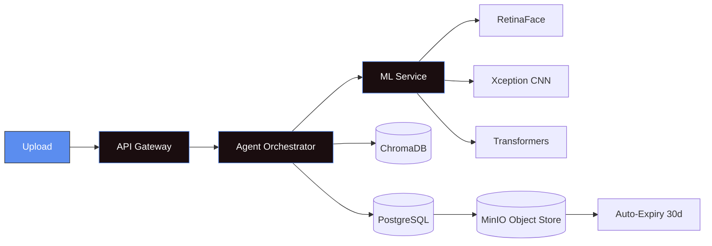
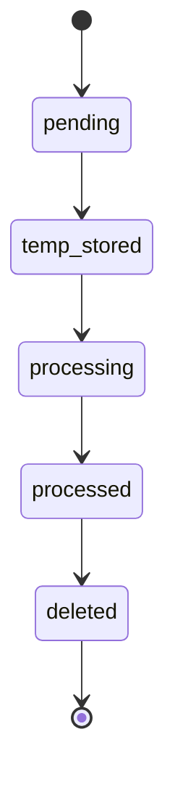
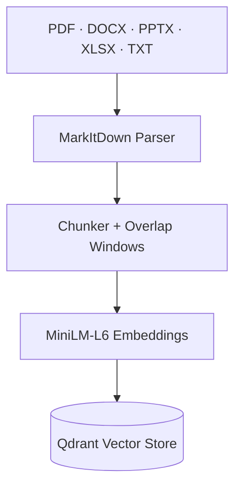
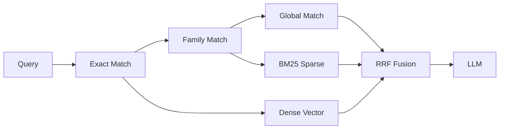
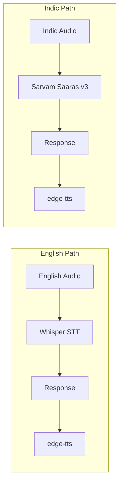
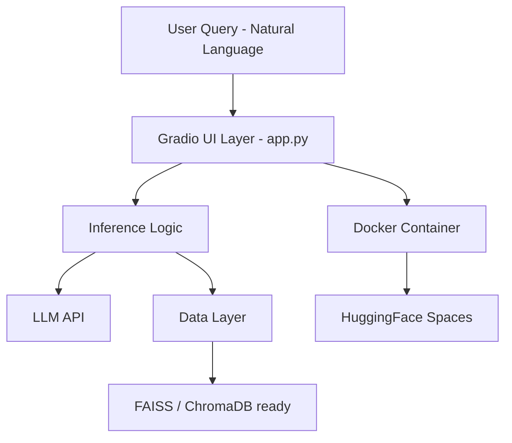
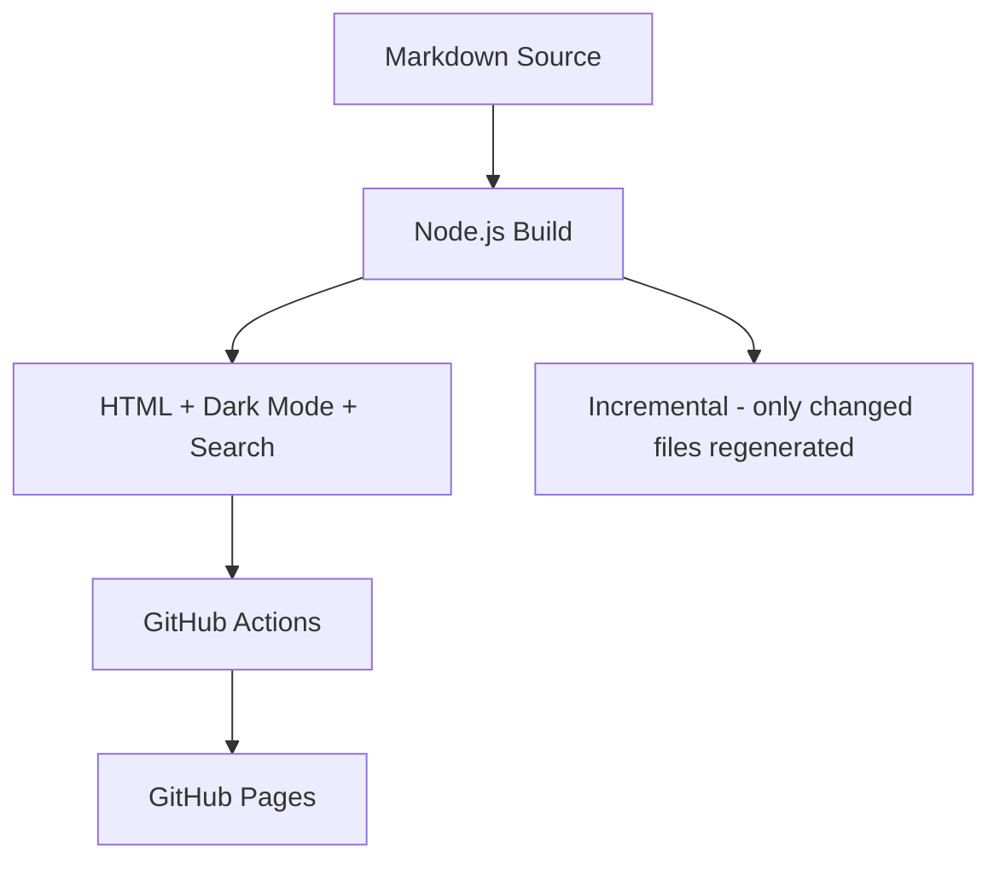

<div align="center">

<!-- ════════════════════════════════════════════════════════════ -->
<!--                      SYSTEM BOOT                           -->
<!-- ════════════════════════════════════════════════════════════ -->

```
╔══════════════════════════════════════════════════════════════════╗
║  SANTHOSH  ·  AI/ML Engineering Runtime  ·  ACTIVE                ║
╚══════════════════════════════════════════════════════════════════╝
```

[](https://git.io/typing-svg)

<br>

[](https://github.com/Santhosh-p653)
[](https://Santhosh-p653.github.io/portfolio/)
[](https://huggingface.co/spaces/santhosh11042007/shoppyai)

</div>

---

<div align="center">

```bash
$ whoami
```

</div>

```
┌─────────────────────────────────────────────────────────────────────┐
│  IDENTITY BLOCK                                                     │
│  ─────────────────────────────────────────────────────────────────  │
│  Role    :  AI / ML Engineer (2nd Year CSE — Karpagam Institute)    │
│  Focus   :  Agentic systems · RAG pipelines · Production MLOps      │
│  Output  :  Deployed systems — not prototypes                       │
│  Mantra  :  "Make it work. Make it right. Make it fast."            │
└─────────────────────────────────────────────────────────────────────┘
```

<br>

---

## `$ developer-os --describe`

> A self-operating system for turning ambiguous problems into deployed AI infrastructure.

```
╔════════════════════════════════════════════════════════════════════════╗
║                  SANTHOSH ENGINEER OS  ·  RUNTIME SPEC                   ║
╠══════════════╦═════════════════════════════════════════════════════════╣
║   INPUT      ║  Problem statements · Research papers · Broken systems   ║
╠══════════════╬═════════════════════════════════════════════════════════╣
║  PROCESSOR   ║  Agentic reasoning (LangGraph)                          ║
║              ║  System design thinking → microservice decomposition    ║
║              ║  Architecture-first, code-second approach               ║
╠══════════════╬═════════════════════════════════════════════════════════╣
║   MEMORY     ║  Qdrant / ChromaDB vector stores                        ║
║              ║  BM25 sparse retrieval + dense embedding fusion         ║
║              ║  Past project patterns as reusable mental models        ║
╠══════════════╬═════════════════════════════════════════════════════════╣
║   OUTPUT     ║  Containerized · CI/CD-wired · Security-hardened        ║
║              ║  JSON-logged · Rate-limited · Production-ready          ║
╠══════════════╬═════════════════════════════════════════════════════════╣
║  OS TRAITS   ║  ✓ Docker from commit one                               ║
║              ║  ✓ GitHub Actions in every repo                         ║
║              ║  ✓ Agents / API / ML as separate bounded services       ║
║              ║  ✓ Security baked in — never bolted on                  ║
╚══════════════╩═════════════════════════════════════════════════════════╝
```

---

## `$ skills --deep`

<div align="center">

```
LOADING MODULE REGISTRY...  ████████████████████████  100%
```

<br>

**`[MODULE 01]` AI CORE ENGINE**


| Component | Tech | Status |
|-----------|------|--------|
| Agent Orchestration | LangGraph · LangChain | 🟢 ACTIVE |
| Vision & Detection | PyTorch · OpenCV · Transformers | 🟢 ACTIVE |
| STT · Multi-language | Whisper · Sarvam AI Saaras v3 | 🟢 ACTIVE |
| TTS Synthesis | edge-tts · Neural Voices | 🟢 ACTIVE |

<br>

**`[MODULE 02]` DATA & RETRIEVAL LAYER**


| Component | Tech | Status |
|-----------|------|--------|
| Vector Store | Qdrant · ChromaDB · FAISS | 🟢 ACTIVE |
| Sparse Retrieval | BM25 · Reciprocal Rank Fusion | 🟢 ACTIVE |
| Document Ingestion | MarkItDown · PDF · DOCX · PPTX | 🟢 ACTIVE |
| Embedding Models | MiniLM-L6 · HuggingFace Hub | 🟢 ACTIVE |

<br>

**`[MODULE 03]` BACKEND SYSTEMS**


| Component | Tech | Status |
|-----------|------|--------|
| API Framework | FastAPI | 🟢 ACTIVE |
| Primary Language | Python | 🟢 ACTIVE |
| Relational Store | PostgreSQL | 🟢 ACTIVE |
| Object Storage | MinIO | 🟢 ACTIVE |

<br>

**`[MODULE 04]` INFRASTRUCTURE & DEVOPS**


| Component | Tech | Status |
|-----------|------|--------|
| Containerization | Docker · Docker Compose | 🟢 ACTIVE |
| CI / CD Pipelines | GitHub Actions | 🟢 ACTIVE |
| Security Scanning | Bandit · detect-secrets · ruff | 🟢 ACTIVE |
| Log Monitoring | Dozzle · JSON stdout | 🟢 ACTIVE |

<br>

**`[MODULE 05]` FRONTEND & UX**


| Component | Tech | Status |
|-----------|------|--------|
| Web Framework | Next.js · TypeScript | 🟢 ACTIVE |
| Rapid Prototyping | Gradio | 🟢 ACTIVE |
| Static Generation | Node.js · GitHub Pages | 🟢 ACTIVE |
| Runtime | Linux | 🟢 ACTIVE |

</div>

---

## `$ projects --list --verbose`

<div align="center">

```
SCANNING PROJECT REGISTRY...  4 SYSTEMS FOUND
```

</div>

---

### `[SYS-01]` 🕵️ deepfake-agentic-ai


[](https://github.com/Santhosh-p653/deepfake-agentic-ai)


**Problem:** Deepfake media is proliferating faster than detection tooling can scale. Existing solutions are monolithic and brittle — one model, one failure point, no auditability.

**Solution:** Forensic deepfake detection architected as a production microservices mesh.





```
Stack:  Python · FastAPI · LangGraph · Docker Compose
        PostgreSQL · ChromaDB · MinIO · RetinaFace · Xception
CI/CD:  GitHub Actions  ·  network audit  ·  logging validation
```

> **Architecture:** Multi-Dockerfile services (`Dockerfile.api` / `Dockerfile.agents` / `Dockerfile.ml`) sharing a single `docker-compose.yml`. JSON-structured logging across every module with live Dozzle viewer.

> **Design decision:** `FLAG_FOR_REVIEW` is treated as an honest middle state, not a failure mode — multi-signal weighted aggregation surfaces uncertainty instead of forcing a binary call.

---

### `[SYS-02]` 🧠 rag-multimodal-assistant


[](https://github.com/Santhosh-p653/rag-multimodal-assistant)


**Problem:** Enterprise manuals exist in a graveyard of PDFs and PPTX files. Users either search manually or get generic LLM hallucinations. No voice support for Indic languages. No agentic troubleshooting.

**Solution:** Production RAG system with hybrid search, voice layer, and LangGraph-powered diagnostic engine.







```
SECURITY STACK:
  slowapi rate limiting · MIME-type guards · regex prompt injection
  isolated RAG prompts · 24-test suite (unit + integration + security)

Stack:  Python · FastAPI · LangGraph · Qdrant · BM25 · MiniLM-L6
        Whisper · Sarvam AI · edge-tts · Next.js · TypeScript · Docker
CI/CD:  GitHub Actions  ·  ruff  ·  black  ·  bandit  ·  detect-secrets
```

> **Architecture:** Full-stack monorepo (`backend/` + `frontend/`). Prompt injection filtered at both the regex layer and the LLM system prompt level. Admin upload panel in Next.js.

> **In progress:** Phase 3 hardening — multi-provider LLM key rotation (Gemini → Groq → SambaNova → HF → OpenAI), VLM-based image captioning, parent-child chunking, BGE reranker.

---

### `[SYS-03]` 🛒 shoppyai


[](https://github.com/Santhosh-p653/shoppyai)
[](https://huggingface.co/spaces/santhosh11042007/shoppyai)


**Problem:** E-commerce discovery still relies on keyword search. Users describe what they want in natural language — the product catalog doesn't speak that.

**Solution:** LLM-powered natural language product discovery deployed publicly on Hugging Face Spaces.



```
Stack:  Python · Gradio · Transformers / LLM APIs · Docker · HF Spaces
CI/CD:  GitHub Actions
```

> **Architecture:** Prompt-orchestration-first design, modular for async inference and vector DB integration with zero structural changes.

---

### `[SYS-04]` 📄 doc2site


[](https://github.com/Santhosh-p653/doc2site)
[](https://santhosh-p653.github.io/doc2site/Santhosh.html)


**Problem:** Markdown documentation has no navigable web presence without a full CMS or framework overhead.

**Solution:** Zero-config static site generator with incremental builds and auto-deploy on push.



```
Stack:  JavaScript · Node.js · GitHub Actions · GitHub Pages
```

---

## `$ analytics --dashboard`

<div align="center">

```
╔══════════════════════════════════════════════════════════════╗
║              SYSTEM METRICS  ·  GITHUB TELEMETRY               ║
╚══════════════════════════════════════════════════════════════╝
```


<br>

| Metric | Value |
|---|---|
| Deployed production repos | 4 |
| Independent microservices shipped | 8+ (API · Agents · ML across 2 systems) |
| CI/CD pipelines maintained | 100% of repos (lint · security scan · deploy) |
| Containerized services | 100% (Docker/Compose on every project) |
| Languages in active rotation | Python · TypeScript · JavaScript |
| Voice/ASR languages supported | English · Tamil · Hindi |

<br>


<br><br>

[](https://github.com/Santhosh-p653)

</div>

> Note: the stats/streak/activity widgets above render live from GitHub's public API at view time — they'll always reflect real, current numbers rather than a static snapshot.

---

## `$ standards --list`

> Every system in this portfolio ships with the same non-negotiables.

```
╔═══════════════════════════════════════════════════════════════╗
║  ENGINEERING INVARIANTS                                        ║
╠═══════════════════════════════════════════════════════════════╣
║  [✓]  Containerized from commit one — Docker / Compose        ║
║  [✓]  CI/CD in every repo — lint · security · deploy          ║
║  [✓]  JSON structured logging — stdout, never print()         ║
║  [✓]  Security-first APIs — rate limit · MIME guard · scan    ║
║  [✓]  Separation of concerns — agents ≠ API ≠ ML              ║
╚═══════════════════════════════════════════════════════════════╝
```

---

<div align="center">

## `$ connect --open-to-work`

```
// Open to roles in AI engineering, MLOps, and agentic systems.
// I build production systems, not demos. Let's build.
```

<br>

[](https://linkedin.com/in/YOUR_LINKEDIN)
[](https://github.com/Santhosh-p653)
[](https://Santhosh-p653.github.io/portfolio/)

<br>


<br>

```
╔══════════════════════════════════════════════════════════════════╗
║  SANTHOSH.OS  ·  SYSTEM HALT  ·  All services nominal.  ✓          ║
╚══════════════════════════════════════════════════════════════════╝
```

</div>